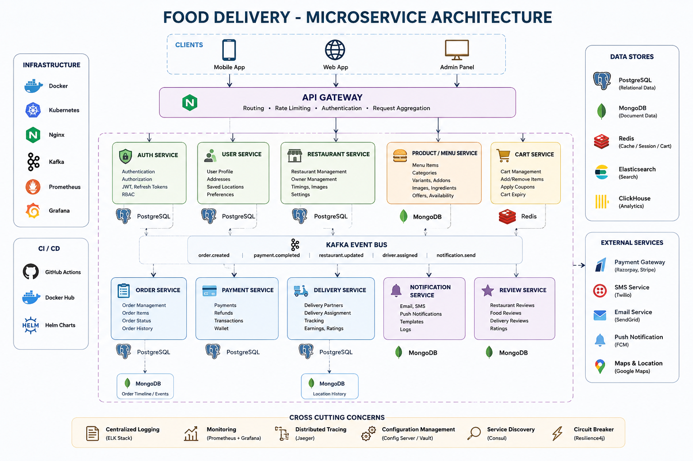

#  Food Delivery Microservices Platform

A scalable, cloud-native **Food Delivery Platform** built using a **Microservices Architecture**. The project is designed with industry best practices, Domain Driven Design (DDD), Event-Driven Communication using Kafka, containerization with Docker, orchestration using Kubernetes, and CI/CD automation.

---

#  Architecture

<p align="center">
    
</p>

---

#  Tech Stack

## Backend

- Node.js
- Express.js
- TypeScript

## Frontend

- React.js
- Next.js

## Databases

- PostgreSQL
- MongoDB
- Redis
- Elasticsearch
- ClickHouse

## DevOps

- Docker
- Kubernetes
- Helm
- Terraform
- Nginx
- GitHub Actions

## Message Broker

- Apache Kafka

## Monitoring

- Prometheus
- Grafana
- ELK Stack
- Jaeger

## Cloud

- AWS
- Cloudflare R2

---

#  Project Structure

```text
food-delivery/

│
├── backend/
│
│   ├── api-gateway/
│
│   ├── auth-service/
│
│   ├── user-service/
│
│   ├── restaurant-service/
│
│   ├── product-service/
│
│   ├── cart-service/
│
│   ├── order-service/
│
│   ├── payment-service/
│
│   ├── delivery-service/
│
│   ├── notification-service/
│
│   ├── review-service/
│
│   ├── inventory-service/
│
│   ├── search-service/
│
│   ├── analytics-service/
│
│   └── recommendation-service/
│
├── frontend/
│
├── docker/
│
├── kubernetes/
│
├── terraform/
│
├── docs/
│
└── README.md
```

---

#  Microservices

| Service | Database | Description |
|----------|----------|-------------|
| API Gateway | — | Single entry point |
| Auth Service | PostgreSQL | Authentication & Authorization |
| User Service | PostgreSQL | User Profile |
| Restaurant Service | PostgreSQL | Restaurant Management |
| Product Service | MongoDB | Menu & Products |
| Cart Service | Redis | Shopping Cart |
| Order Service | PostgreSQL | Orders |
| Payment Service | PostgreSQL | Payments |
| Delivery Service | PostgreSQL + MongoDB | Delivery & GPS History |
| Notification Service | MongoDB | Email, SMS & Push |
| Review Service | MongoDB | Reviews |
| Inventory Service | PostgreSQL | Inventory |
| Search Service | Elasticsearch | Product Search |
| Recommendation Service | Redis + MongoDB | Recommendations |
| Analytics Service | ClickHouse | Reports & Analytics |

---

#  Request Flow

```text
Client

      │

      ▼

API Gateway

      │

      ▼

Authentication

      │

      ▼

Microservices

      │

      ▼

Kafka Event Bus

      │

      ▼

Other Services

      │

      ▼

Database
```

---

#  Database Architecture

```text
Auth Service
      │
 PostgreSQL

User Service
      │
 PostgreSQL

Restaurant Service
      │
 PostgreSQL

Product Service
      │
 MongoDB

Cart Service
      │
 Redis

Order Service
      │
 PostgreSQL

Payment Service
      │
 PostgreSQL

Delivery Service
      │
 PostgreSQL
      │
 MongoDB

Notification Service
      │
 MongoDB

Review Service
      │
 MongoDB

Inventory Service
      │
 PostgreSQL

Search Service
      │
 Elasticsearch

Recommendation Service
      │
 Redis + MongoDB

Analytics Service
      │
 ClickHouse
```

---

#  Event-Driven Communication

Kafka Topics

```text
user.created

restaurant.created

product.created

cart.updated

order.created

order.confirmed

payment.completed

payment.failed

driver.assigned

driver.location.updated

order.delivered

notification.send

review.created
```

---

# 🔐 Features

- JWT Authentication
- Refresh Tokens
- Role-Based Access Control (RBAC)
- API Gateway
- Distributed Microservices
- Event-Driven Architecture
- Kafka Messaging
- Redis Caching
- Full-Text Search
- Order Tracking
- Real-Time Notifications
- Cloud Storage
- Dockerized Services
- Kubernetes Deployment
- CI/CD Pipeline
- Monitoring & Logging

---

# ⚙️ Installation

```bash
git clone https://github.com/your-username/food-delivery.git

cd food-delivery
```

Install dependencies

```bash
npm install
```

Run Docker

```bash
docker compose up --build
```

---

# 🚀 Run Services

```bash
npm run dev
```

---

# ☸️ Kubernetes

```bash
kubectl apply -f kubernetes/
```

---

# 🐳 Docker

```bash
docker compose up
```

---

# 📊 Monitoring

- Prometheus
- Grafana
- ELK Stack
- Jaeger

---

# 🔮 Future Enhancements

- AI Recommendation Engine
- Real-Time Driver Tracking
- Voice Ordering
- Multi-Tenant Restaurants
- Dynamic Pricing
- Coupon Engine
- Fraud Detection
- ML-Based Food Recommendation
- Event Sourcing
- CQRS

---

# 👨‍💻 Author

Malay Maity

Backend Developer | MERN Stack | Node.js | TypeScript | Microservices | Kubernetes | AWS

---